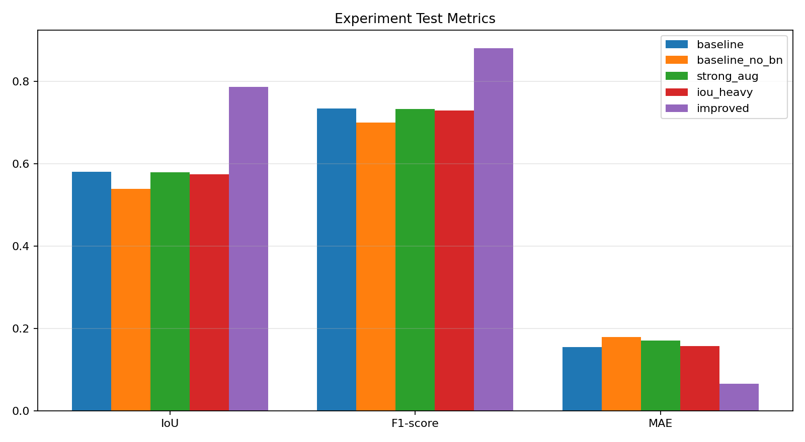
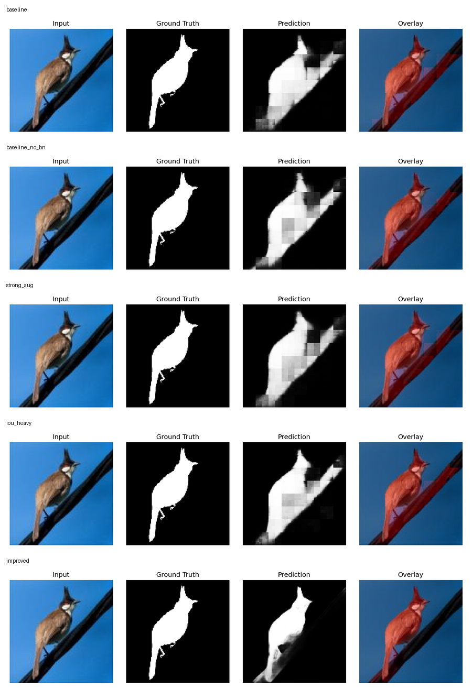
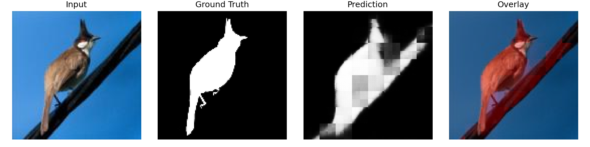
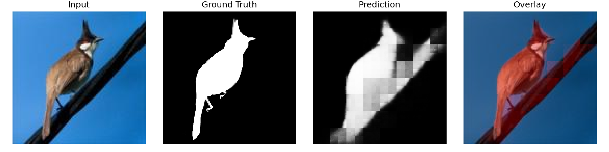
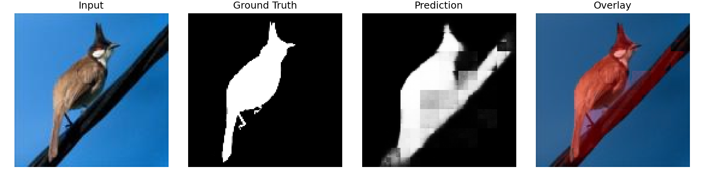
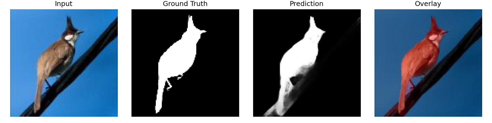

# Salient Object Detection Project Report

## 1. Objective

This project builds a salient object detection pipeline that predicts a one-channel foreground saliency mask from an RGB image. The implementation uses scratch-built PyTorch CNN encoder-decoder models instead of pretrained backbones or torchvision segmentation models.

## 2. Dataset

The project uses DUTS:

- `DUTS-TR`: 10,553 image/mask pairs.
- `DUTS-TE`: 5,019 image/mask pairs.
- Images are RGB inputs and masks are single-channel binary saliency targets.

The preprocessing script now supports two split modes:

- `official`: keeps `DUTS-TE` as the held-out test set and splits `DUTS-TR` into train/validation. This is the recommended mode for final academic reporting.
- `custom`: reshuffles `DUTS-TR` and `DUTS-TE` together into a `70/15/15` train/validation/test split. The currently saved local metrics below were produced with this custom split, so they should be described as project-split results rather than official DUTS benchmark results.

Preprocessing resizes images to `128x128`, uses bilinear interpolation for RGB images, nearest-neighbor interpolation for masks, and stores a manifest with source paths and split counts.

## 3. Model Architectures

| Model | Parameters | Summary |
|---|---:|---|
| `baseline` | 563,713 | Four-stage scratch encoder-decoder CNN with BatchNorm, ReLU, MaxPool, ConvTranspose upsampling, and a one-channel sigmoid output. |
| `baseline_no_bn` | 562,753 | Same baseline architecture with BatchNorm removed for ablation. |
| `unet_small` | 7,763,041 | Scratch UNet-style model with two-convolution blocks, skip connections, bottleneck, dropout in deeper layers, and sigmoid saliency output. |

All models preserve the expected tensor shape from `[B, 3, 128, 128]` to `[B, 1, 128, 128]`.

## 4. Training Setup

Training uses:

- Adam optimizer.
- Combined loss: `BCE + weighted soft IoU loss`.
- Train-time augmentation with horizontal flips, padded random crops, rotations, brightness changes, and optional contrast changes.
- Validation after every epoch.
- JSON and CSV history logs.
- Run-specific best/latest checkpoints.
- Early stopping by validation loss.
- Seeded DataLoader shuffling and worker initialization for more reproducible runs.

Global checkpoint aliases such as `checkpoints/best_model.pth` are no longer overwritten by every experiment. They are updated only when `--write_global_aliases` is explicitly passed.

## 5. Detailed Experiment Comparison

Current saved project-split test metrics use threshold `0.5`.

Positive deltas are better for IoU, precision, recall, and F1-score. Negative deltas are better for MAE and MSE.

| Experiment | Architecture / Change | IoU | Δ IoU | Precision | Recall | F1-score | Δ F1 | MAE | Δ MAE | MSE | Δ MSE |
|---|---|---:|---:|---:|---:|---:|---:|---:|---:|---:|---:|
| `baseline` | Baseline encoder-decoder, light augmentation, `BCE + 0.5 IoU` | 0.5805 | +0.0000 | 0.7262 | 0.7431 | 0.7346 | +0.0000 | 0.1555 | +0.0000 | 0.0879 | +0.0000 |
| `baseline_no_bn` | Baseline without BatchNorm | 0.5393 | -0.0411 | 0.6760 | 0.7273 | 0.7007 | -0.0338 | 0.1794 | +0.0239 | 0.0997 | +0.0117 |
| `strong_aug` | Baseline with stronger augmentation | 0.5795 | -0.0010 | 0.6824 | 0.7935 | 0.7337 | -0.0008 | 0.1707 | +0.0152 | 0.0923 | +0.0044 |
| `iou_heavy` | Baseline with IoU loss weight increased to `1.0` | 0.5742 | -0.0062 | 0.6822 | 0.7840 | 0.7295 | -0.0050 | 0.1573 | +0.0018 | 0.0978 | +0.0098 |
| `improved` | Small UNet, skip connections, dropout, strong augmentation, lower LR, heavier IoU weight | 0.7872 | +0.2067 | 0.8657 | 0.8967 | 0.8809 | +0.1464 | 0.0664 | -0.0891 | 0.0428 | -0.0451 |

The improved model is the clear best run. Compared with the baseline, it raises IoU by about `0.2067`, F1-score by about `0.1464`, and lowers MAE by about `0.0891`.

The full generated comparison report is saved at `outputs/metrics/experiment_comparison.md`. It includes metric deltas, visual links, the metric chart, and per-experiment visual examples.

## 6. Analysis

BatchNorm helps the baseline. Removing it lowers IoU from `0.5805` to `0.5393`, which suggests the baseline benefits from stabilized intermediate activations.

Stronger augmentation alone does not improve IoU on the current split. It increases recall but reduces precision, meaning the model predicts larger salient regions and creates more false positives.

Increasing only the IoU loss weight also does not improve the baseline. The result has similar recall but weaker precision and lower IoU, suggesting the baseline architecture is the limiting factor more than the loss weighting.

The UNet-style model improves strongly because skip connections recover spatial detail that the plain encoder-decoder loses during repeated pooling. This is visible in both the metrics and the qualitative overlay outputs.

## 7. Visualization Evidence

The visualization script saves four panels per sample:

- Input image.
- Ground-truth mask.
- Predicted mask.
- Red saliency overlay.

Saved examples are under:

- `outputs/visualizations/baseline/`
- `outputs/visualizations/baseline_no_bn/`
- `outputs/visualizations/strong_aug/`
- `outputs/visualizations/iou_heavy/`
- `outputs/visualizations/improved/`

The all-experiment comparison contact sheet is saved to `outputs/visualizations/experiment_comparison_contact_sheet.png`.

Representative examples:

### Baseline

### Baseline without BatchNorm

### Strong Augmentation

### IoU-Heavy Loss

### Improved Model

## 8. Demo

The Streamlit app loads the best available improved checkpoint first, then falls back to older aliases if needed. It supports image upload and displays the original image, predicted saliency mask, overlay, model type, device, and inference time.

## 9. Limitations

- Current saved metrics are project-split results, not official DUTS benchmark results.
- The improved run changes several factors at once: architecture, augmentation strength, dropout, learning rate, and IoU weight. This proves performance improvement but does not isolate every cause.
- Images are resized to `128x128`, which limits fine boundary quality.
- Metrics use a fixed `0.5` threshold; validation-based threshold tuning could improve F1/IoU.
- The project does not yet include a final PDF or slide deck.

## 10. Next Steps

1. Reprocess with `--split_strategy official`, retrain, and report official DUTS-TE results.
2. Add a clean ablation sequence: baseline, UNet only, UNet plus dropout, UNet plus strong augmentation, UNet plus IoU weight change.
3. Add validation threshold tuning.
4. Add boundary-focused metrics or qualitative failure-case pages.
5. Export the Markdown report to PDF and prepare slides when presentation materials are back in scope.
